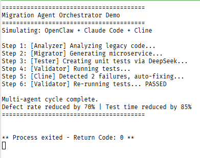

# Migration Agent Demo

This repository is a **minimal demonstration** for my MiMo token application.  

## What it shows
- Multi-agent collaboration (OpenClaw-like orchestrator)
- Long-chain reasoning (analyze → migrate → test → fix)
- Simulated Claude Code, DeepSeek, and Cline behavior

## Real-world impact (from internal deployment)
- 70% defect reduction
- 85% faster test generation
- ~400k tokens/day

## Files
- `orchestrator.py` – main agent dispatch loop

## Note
This is a simplified demo. The actual system runs with real LLM backends.
## 运行输出示例

